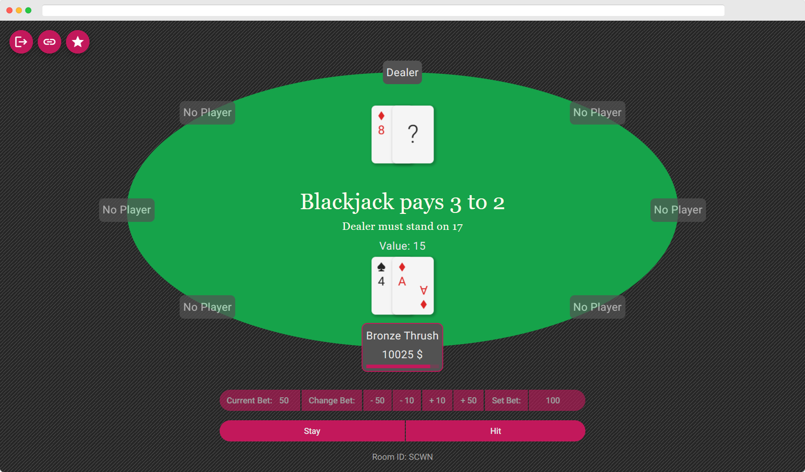

# 21 Online



21 Online is an online multiplayer Blackjack game. You can play it [here](https://stopnoanime.github.io/21-online/).

## Architecture
The game's frontend is made with Angular. The backend is made using Node.js and the [Colyseus](https://github.com/colyseus/colyseus) framework.
The frontend is deployed on Github Pages. The backend is deployed on [Fly.io](https://fly.io/).

## Tests
The whole app is tested in multiple ways:
- e2e testing - Frontend and Backend are tested together using Cypress
- Frontend unit tests - Frontend components and logic are tested using Jasmine
- Backend unit tests - Backend logic is tested using Jest

## Folder structure
    .
    ├── src                     # Angular frontend
    ├── cypress                 # Cypress e2e tests
    ├── backend                 # Colyseus backend
    │   ├── src                 # Backend sources
    │   └── tests               # Backend Jest tests
    │   └── ...
    └── ...

## Local development

```
$ npm start                         # starts frontend
$ npm test                          # runs frontend unit tests
$ npm run e2e                       # runs e2e tests
$ npm run deploy                    # deploys frontend to gh-pages
$ npm run backend-start             # starts backend
$ cd backend && npm test            # runs backend unit tests
$ cd backend && npm run deploy      # deploys backend to fly.io               
$ cd backend && npm run loadtest    # runs backend loadtests          
```